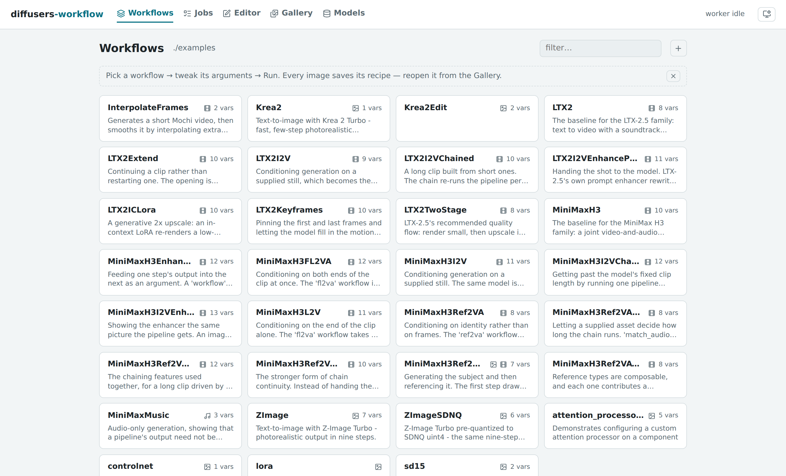
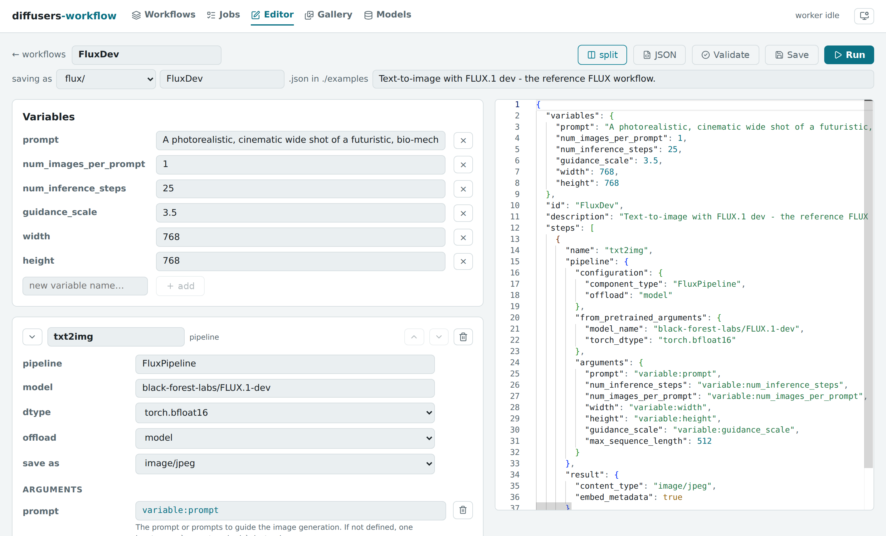
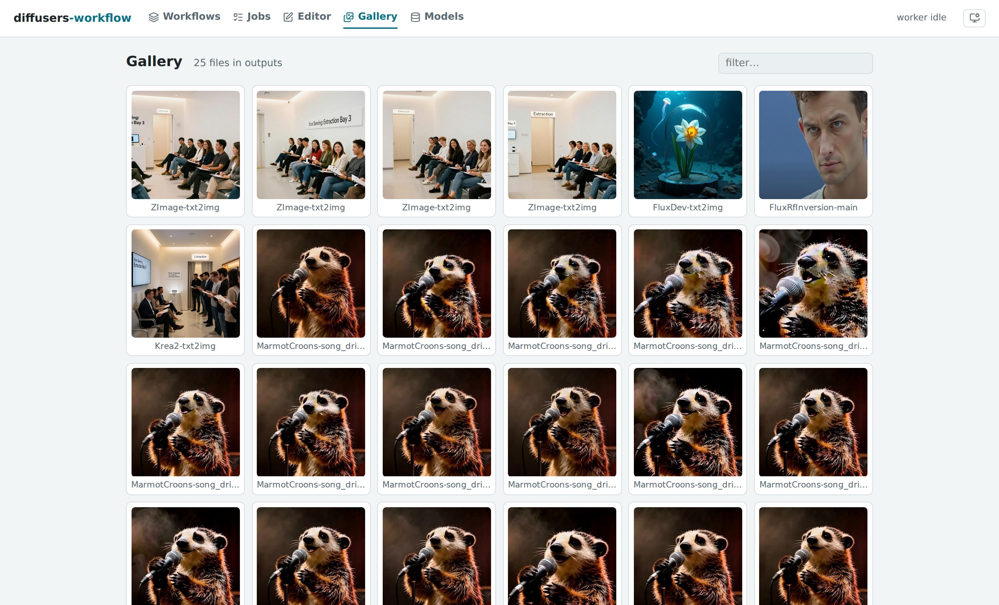
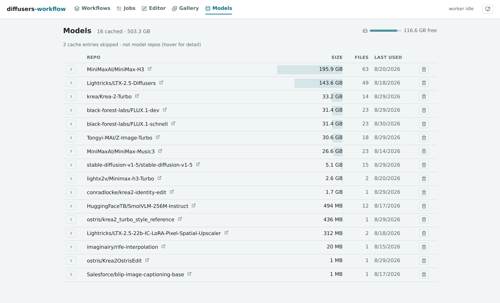

[](https://github.com/dkackman/diffusers-workflow/actions/workflows/github-code-scanning/codeql)

# diffusers-workflow

A declarative workflow engine and web UI for the [Hugging Face Diffusers library](https://github.com/huggingface/diffusers). Define image/video generation pipelines in JSON — with full access to the configuration diffusers exposes — and run them from the command line, an interactive REPL, or a browser.

A workflow JSON file is portable and easy to hand off — but that same flexibility means loading one can execute arbitrary Python (dynamic imports are how it reaches any diffusers pipeline or quantization backend without a bespoke adapter for each). Treat a workflow file from someone else the way you'd treat a `.py` script: see [Trust model](docs/SECURITY.md#trust-model) before running one you didn't write.

**Python 3.10-3.14 | CUDA (NVIDIA) | MPS (Apple Silicon) | CPU**

<picture>
  <source media="(prefers-color-scheme: dark)" srcset="docs/img/ui-workflows-dark.png">
  
</picture>

## Features

- **Web UI** — browse and run workflows, edit them in introspection-driven forms, watch jobs stream live progress, manage generated output and the models on disk. `python -m dw.serve` and open a browser. See [Server & Web UI](docs/SERVER.md).
- **MCP server** — a tool surface that lets an MCP client (Claude Code first) author, validate, save, run and diagnose workflows against a running `dw.serve`: `dw-mcp` over stdio, or mounted at `/mcp` by `dw.serve --mcp` for a client on another machine. See [MCP Server](docs/MCP.md) and [Remote GPU server](docs/REMOTE.md).
- **Step-output caching** — a step whose resolved arguments and seed are unchanged since the last run in the same process reuses its cached result instead of re-executing. This applies to any `Workflow.run` — REPL iteration and a re-run of a server-submitted job alike, so re-running a fixed-seed workflow from the UI finishes instantly and writes no new output files. The cache holds the most recent 50 steps and is dropped by `memory clear`
- **Declarative JSON workflows** with variable substitution and cross-step data flow
- **Multi-step pipelines** — chain text-to-image, image-to-video, inpainting, ControlNet
- **Reproducible by construction** — outputs embed their full workflow definition and seed; any image in the gallery reopens as the exact workflow that made it (see [Trust model](docs/SECURITY.md#trust-model) before reopening one someone else sent you). A rerun never overwrites a prior output — a name collision gets an incrementing suffix instead
- **Long-video chaining** — run a video pipeline once per segment and stitch the segments into one clip, with audio-driven length and frame-to-frame continuity
- **Quantization** — BitsAndBytes, TorchAO, GGUF, SDNQ, optimum-quanto
- **Inference acceleration** — TeaCache, FirstBlockCache, FasterCache, MagCache, TaylorSeerCache
- **Prompt weighting** — A1111-style `(word:1.5)` syntax with long prompt support
- **Prompt library** — store prompts once in `prompts/` and reference them from any workflow as `prompt:name` or `prompt:folder/name`, with a web UI for browsing, editing, and AI-enhancing them
- **LoRA and IP-Adapter** support
- **Composable workflows** from multiple JSON files with `builtin:` references
- **Utility tasks** — upscaling, face restoration, segmentation, captioning, frame interpolation, QR codes, and more
- **Interactive REPL** with persistent GPU model caching (2-4x faster iteration)
- **Cross-platform** — CUDA, MPS (Apple Silicon), and CPU

## Installation

### Linux / macOS

```bash
bash ./install.sh
source ./activate
python -m dw.test
```

### Windows

```powershell
.\install.ps1
.\venv\scripts\activate
python -m dw.test
```

The install scripts detect your Python version, create a virtual environment, and install all dependencies including platform-specific packages (bitsandbytes on CUDA, fp4-fp8-for-torch-mps on macOS).

## The Web UI

```bash
python -m dw.serve
# diffusers-workflow server on http://127.0.0.1:8765
```

Everything the engine does, in a browser backed by a persistent GPU worker — models stay loaded between runs.

**A form-based editor with the real pipeline signatures.** Forms and argument autocomplete are generated by introspecting diffusers itself, so every knob a pipeline exposes is available — with its documentation — without leaving the browser. A split view puts the JSON beside the form, both editable; validation catches schema errors *and* argument typos (by checking the pipeline's actual call signature) before any model loads.



**A gallery where every image is a recipe.** Outputs embed their workflow and seed; *open as workflow* drops the definition into the editor with the seed pinned, ready to reproduce or riff on.



**A prompt library shared by every workflow.** Store a prompt once, reference it anywhere as `prompt:name` — the Prompts page browses, edits, and filters the library, and an *Enhance with AI* panel expands an idea into a full prompt with a local language model.

**A model manager for the disk your models actually consume.** The Hugging Face hub cache, inventoried: sizes, revisions, last-used dates, free space — download new models by id with live progress, delete with one click.



Jobs queue, stream progress live (per denoising step), cancel cooperatively, and persist to a searchable history. See [Server & Web UI](docs/SERVER.md) for the pages and the HTTP API.

## Usage

### Run a Workflow

`workflows/sd15.json` is the smallest, fastest starting point — a small, ungated model and a literal prompt, so the first run needs no Hugging Face login and downloads only a few GB:

```bash
python -m dw.run workflows/sd15.json
python -m dw.run workflows/sd15.json prompt="a cat" num_images_per_prompt=4
```

Most of the workflows under `workflows/` (Flux, LTX-2, MiniMax...) use **gated** Hugging Face models — the repo owner has to approve your account before you can download them. Before running one of those, request access on the model's Hugging Face page (e.g. [black-forest-labs/FLUX.1-dev](https://huggingface.co/black-forest-labs/FLUX.1-dev)) and log in locally:

```bash
huggingface-cli login
python -m dw.run workflows/flux/FluxDev.json
```

Without this, the run fails partway through with an HTTP 401/403 from the Hub.

### Validate a Workflow

```bash
python -m dw.validate workflows/sd15.json
```

### Interactive REPL

```bash
python -m dw.repl
```

```text
dw> workflow load flux/FluxDev
dw> arg set prompt="a beautiful sunset"
dw> workflow run
[... models load once ...]

dw> arg set prompt="a starry night"
dw> workflow run
Reusing loaded models from cache
[... 2-4x faster ...]

dw> memory show
dw> ?               # show all command groups
```

See [REPL Commands](docs/REPL_COMMANDS.md) and [Worker Guide](docs/REPL_WORKER_GUIDE.md).

## Workflow Examples

### Simple Image Generation

```json
{
    "id": "flux_example",
    "variables": {
        "prompt": "an apple",
        "num_images_per_prompt": 1
    },
    "steps": [
        {
            "name": "main",
            "pipeline": {
                "configuration": {
                    "component_type": "FluxPipeline",
                    "offload": "sequential"
                },
                "from_pretrained_arguments": {
                    "model_name": "black-forest-labs/FLUX.1-dev",
                    "torch_dtype": "torch.bfloat16"
                },
                "arguments": {
                    "prompt": "variable:prompt",
                    "num_inference_steps": 25,
                    "num_images_per_prompt": "variable:num_images_per_prompt",
                    "guidance_scale": 3.5
                }
            },
            "result": {
                "content_type": "image/jpeg"
            }
        }
    ]
}
```

Override variables from the command line:

```bash
python -m dw.run flux_example.json prompt="an orange" num_images_per_prompt=4
```

### Multi-Step Workflow (Image to Video)

Chain steps using `previous_result:step_name` to pass outputs between steps:

```json
{
    "id": "img2vid",
    "steps": [
        {
            "name": "image_generation",
            "pipeline": {
                "configuration": {
                    "component_type": "StableDiffusion3Pipeline",
                    "offload": "model"
                },
                "from_pretrained_arguments": {
                    "model_name": "stabilityai/stable-diffusion-3.5-large",
                    "torch_dtype": "torch.bfloat16"
                },
                "arguments": {
                    "prompt": "a luminous owl in a neon forest",
                    "num_inference_steps": 25,
                    "guidance_scale": 4.5
                }
            },
            "result": { "content_type": "image/png" }
        },
        {
            "name": "video",
            "pipeline": {
                "configuration": {
                    "component_type": "CogVideoXImageToVideoPipeline",
                    "offload": "sequential",
                    "vae": { "configuration": { "enable_slicing": true, "enable_tiling": true } }
                },
                "from_pretrained_arguments": {
                    "model_name": "THUDM/CogVideoX-5b-I2V",
                    "torch_dtype": "torch.bfloat16"
                },
                "arguments": {
                    "image": "previous_result:image_generation",
                    "prompt": "The owl blinks slowly",
                    "num_inference_steps": 50,
                    "num_frames": 49,
                    "guidance_scale": 6
                }
            },
            "result": { "content_type": "video/mp4" }
        }
    ]
}
```

### Inference Acceleration

Speed up generation with built-in diffusers caching or TeaCache:

```json
"configuration": {
    "component_type": "FluxPipeline",
    "cache": { "type": "first_block", "threshold": 0.05 }
}
```

```json
"configuration": {
    "component_type": "FluxPipeline",
    "teacache": { "rel_l1_thresh": 0.6 }
}
```

### Prompt Weighting

Use A1111-style syntax for per-token weighting:

```json
"configuration": {
    "component_type": "FluxPipeline",
    "prompt_weighting": true
}
```

```text
a (photorealistic:1.4) portrait with (bright red hair:1.3) and [freckles]
```

## JSON Schema

**Interactive schema browser:** [View Schema](https://json-schema.app/view/%23?url=https%3A%2F%2Fraw.githubusercontent.com%2Fdkackman%2Fdiffusers-workflow%2Frefs%2Fheads%2Fmaster%2Fdw%2Fworkflow_schema.json)

See [workflows/](workflows/) for more workflow files.

## Documentation

### Guides

- [Server & Web UI](docs/SERVER.md) — The web UI, jobs API, and introspection service
- [MCP Server](docs/MCP.md) — Tool surface for MCP clients (Claude Code, Claude Desktop)
- [Remote GPU server](docs/REMOTE.md) — Using the server, UI and MCP from another machine
- [Workflow Guide](docs/WORKFLOW_GUIDE.md) — JSON structure, variables, steps, data flow
- [Workspaces](docs/WORKSPACES.md) — Keeping your workflows, prompts and outputs outside the repo
- [Quantization](docs/QUANTIZATION.md) — BitsAndBytes, TorchAO, GGUF, SDNQ
- [Inference Acceleration](docs/ACCELERATION.md) — torch.compile, FirstBlockCache, MagCache, TaylorSeer, TeaCache
- [Fast on 24GB](docs/RECIPES_24GB.md) — Recommended speed/memory configurations per model family
- [LoRA](docs/LORAS.md) — Loading and stacking LoRA adapters
- [IP-Adapter](docs/IP_ADAPTER.md) — Image-prompt conditioning
- [Prompt Weighting](docs/PROMPT_WEIGHTING.md) — A1111-style syntax
- [Prompt References](docs/WORKFLOW_GUIDE.md#prompt-references) — The stored prompt library and `prompt:` references
- [Tasks](docs/TASKS.md) — Image processing, ControlNet preprocessors, utilities

### Reference

- [REPL Commands](docs/REPL_COMMANDS.md) — Interactive REPL command reference
- [Worker Guide](docs/REPL_WORKER_GUIDE.md) — GPU persistence and troubleshooting
- [Dependencies](docs/DEPENDENCIES.md) — Installation details
- [Security](docs/SECURITY.md) — Security model
- [Testing](docs/TESTING.md) — Running the test suite
- [Releasing](docs/RELEASING.md) — Cutting a release from a version tag
