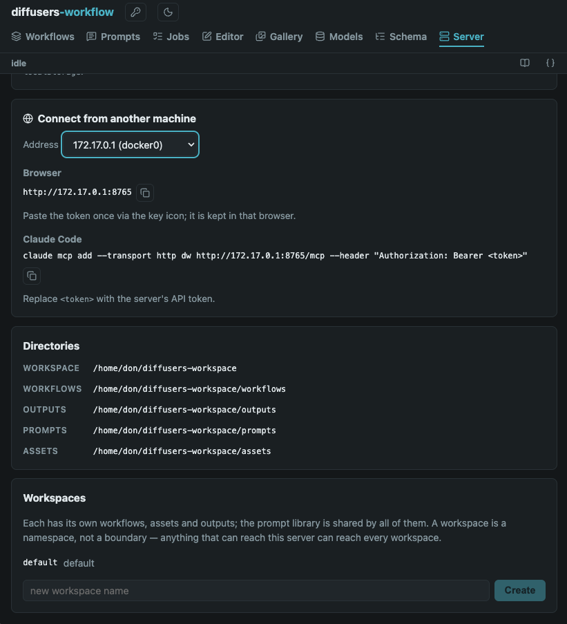
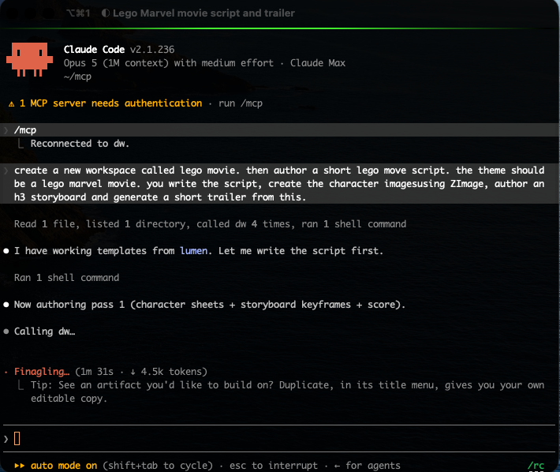
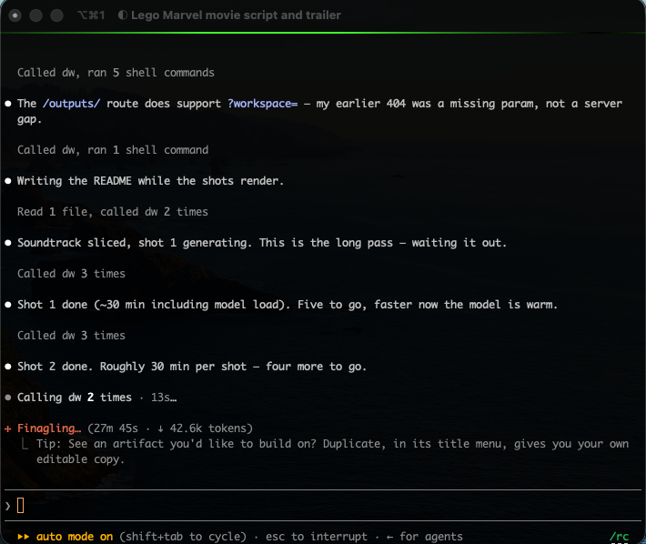

[](https://github.com/dkackman/diffusers-workflow/actions/workflows/github-code-scanning/codeql)

# diffusers-workflow

Your GPU, as something an agent can drive.

diffusers-workflow turns the [Hugging Face Diffusers library](https://github.com/huggingface/diffusers)
into a declarative engine — image and video pipelines described as data rather
than as Python — and then puts three front ends on it: an **MCP server** so
Claude Code (or any MCP client) can author, run and inspect generations; a
**web UI**; and a **CLI/REPL**. The JSON is the wire format underneath. Most
days you don't write it by hand.

**Python 3.10-3.14 | CUDA (NVIDIA) | MPS (Apple Silicon) | CPU**

<picture>
  <source media="(prefers-color-scheme: dark)" srcset="docs/img/ui-workflows-dark.png">
  
</picture>

A workflow file is portable and easy to hand off — but that same flexibility
means loading one can execute arbitrary Python (dynamic imports are how it
reaches any diffusers pipeline or quantization backend without a bespoke
adapter for each). Treat a workflow file from someone else the way you'd treat
a `.py` script: see [Trust model](docs/SECURITY.md#trust-model) before running
one you didn't write.

## Drive it from Claude Code

Two processes: the engine, and the agent that talks to it.

```bash
# 1. the engine, holding your workspace. Leave it running.
python -m dw.serve --workspace ~/studio --examples-dir ~/src/diffusers-workflow/workflows

# 2. register the MCP server with Claude Code (absolute path - see docs/MCP.md)
claude mcp add dw -- "$(pwd)/venv/bin/dw-mcp"
```

If the GPU is a different machine, start it with `--mcp` and skip the local
install entirely — Claude Code connects over HTTP:

```bash
# on the GPU box
python -m dw.serve --host 0.0.0.0 --token "$DW_API_TOKEN" --mcp --workspace ~/studio

# on your laptop
claude mcp add --transport http dw http://gpu-box:8765/mcp \
  --header "Authorization: Bearer $DW_API_TOKEN"
```

You don't have to compose that command by hand — the server's own **Server**
page builds it from the address you pick, alongside the directories it
resolved and the workspaces it holds:



Then just ask. The agent has 50 tools covering the whole surface — the
workflow catalog, the real diffusers pipeline signatures, the job queue, the
gallery, the model cache:



Generation is the long pass, and the agent stays with it — queuing each shot,
waiting it out, and reporting what came back:



> **What can this box actually run, and what workflows do I already have?**
>
> Claude calls `get_server_info` (device, version, workspace), `list_workflows`
> (each with its description, variables and output kinds), and `list_models`
> (what's already in the hub cache). It tells you the accelerator before it
> proposes anything CUDA-only.

> **Take my Flux workflow, swap in the portrait LoRA, and render four at 1024
> square.**
>
> `get_workflow` to read it, `get_pipeline_signature` to check the arguments
> actually exist, `validate_workflow` (free — schema *and* signature checking,
> no model loads), `save_workflow` into your workspace, then `run_workflow`.
> That last one refuses unless it passes `acknowledged_cost=true`, so the agent
> has to tell you it's about to spend GPU minutes before it spends them.

> **How's it going?**
>
> `wait_for_job` blocks for a bounded interval instead of hand-polling;
> `get_job_events` pages through per-step and per-denoise-step progress.
> `get_output_image` brings the result back into the conversation, downscaled,
> so the agent can look at what it made and say whether it matches what you
> asked for.

> **That third frame is the one. Keep it, and use it to seed the video pass.**
>
> `keep_output` promotes the file into the asset library under a name you pick
> — the agent then writes `asset:hero-frame.png` into the next workflow, rather
> than a run id that pruning would break.

Nothing above needs a shell on the GPU box or a checkout of this repository.
Six tools that cost real money or real disk (`run_workflow`, `rerun_job`,
`enhance_prompt`, `download_model`, `delete_model`, `update_diffusers`) plus
`delete_workspace` refuse until they're explicitly acknowledged, so an agent
cannot quietly burn an hour of GPU time or delete 40GB of weights.

Full setup, the complete tool reference, and the troubleshooting table:
[MCP Server](docs/MCP.md). Running it on another machine end to end:
[Remote GPU server](docs/REMOTE.md).

### Several agents, one GPU

A server holds several **workspaces** — each with its own workflows, assets
and outputs, sharing one prompt library. An agent calls `use_workspace` once
and everything it reads and writes for the rest of the session lands there, so
two agents (or an agent and you, in the browser) share the GPU without saving
over each other. See [Workspaces](docs/WORKSPACES.md).

## The Web UI

```bash
python -m dw.serve
# diffusers-workflow server on http://127.0.0.1:8765
```

Everything the engine does, in a browser backed by the same persistent GPU
worker — models stay loaded between runs.

**A form-based editor with the real pipeline signatures.** Forms and argument
autocomplete are generated by introspecting diffusers itself, so every knob a
pipeline exposes is available — with its documentation — without leaving the
browser. A split view puts the JSON beside the form, both editable; validation
catches schema errors *and* argument typos (by checking the pipeline's actual
call signature) before any model loads. A flow view draws the workflow's
data-flow graph.


**A gallery where every image is a recipe.** Each run gets its own directory
with a `manifest.json` beside its files, and images carry their full workflow
definition and seed; *open as workflow* drops the definition into the editor
with the seed pinned, ready to reproduce or riff on. *Keep as asset* promotes a
generated file into the asset library so later workflows can rely on it.


**A prompt library shared by every workflow.** Store a prompt once, reference
it anywhere as `prompt:name` — the Prompts page browses, edits, and filters the
library, and an *Enhance with AI* panel expands an idea into a full prompt with
a local language model.

**A model manager for the disk your models actually consume.** The Hugging Face
hub cache, inventoried: sizes, revisions, last-used dates, free space — download
new models by id with live progress, delete with one click.


Jobs queue, stream progress live (per denoising step), cancel cooperatively,
and persist to a searchable history. See [Server & Web UI](docs/SERVER.md) for
the pages and the HTTP API.

## The command line

The engine runs standalone, with no server involved.
`workflows/sd15.json` is the smallest starting point — a small, ungated model
and a literal prompt, so the first run needs no Hugging Face login and
downloads only a few GB:

```bash
python -m dw.run workflows/sd15.json
python -m dw.run workflows/sd15.json prompt="a cat" num_images_per_prompt=4
python -m dw.validate workflows/sd15.json
```

Most of the workflows under `workflows/` (Flux, LTX-2, MiniMax...) use **gated**
Hugging Face models — the repo owner has to approve your account first. Request
access on the model's page (e.g. [black-forest-labs/FLUX.1-dev](https://huggingface.co/black-forest-labs/FLUX.1-dev)),
then:

```bash
huggingface-cli login
python -m dw.run workflows/flux/FluxDev.json
```

Without this, the run fails partway through with an HTTP 401/403 from the Hub.

An interactive REPL keeps models resident between runs for 2-4x faster
iteration:

```text
dw> workflow load flux/FluxDev
dw> arg set prompt="a beautiful sunset"
dw> workflow run
[... models load once ...]

dw> arg set prompt="a starry night"
dw> workflow run
Reusing loaded models from cache
[... 2-4x faster ...]
```

See [REPL Commands](docs/REPL_COMMANDS.md) and [Worker Guide](docs/REPL_WORKER_GUIDE.md).

## Installation

### Linux / macOS

```bash
bash ./install.sh
source ./activate
python -m dw.test
```

### Windows

```powershell
.\install.ps1
.\venv\scripts\activate
python -m dw.test
```

The install scripts detect your Python version, create a virtual environment,
and install all dependencies including platform-specific packages (bitsandbytes
on CUDA, fp4-fp8-for-torch-mps on macOS).

## What a workflow is

Underneath every front end is one JSON document: named steps, each a diffusers
pipeline or a utility task, with arguments that can reference variables,
earlier steps' outputs, stored prompts, assets, and files an earlier run wrote.

```json
{
    "id": "flux_example",
    "variables": { "prompt": "an apple" },
    "steps": [
        {
            "name": "main",
            "pipeline": {
                "configuration": { "component_type": "FluxPipeline", "offload": "sequential" },
                "from_pretrained_arguments": {
                    "model_name": "black-forest-labs/FLUX.1-dev",
                    "torch_dtype": "torch.bfloat16"
                },
                "arguments": {
                    "prompt": "variable:prompt",
                    "num_inference_steps": 25,
                    "guidance_scale": 3.5
                }
            },
            "result": { "content_type": "image/jpeg" }
        }
    ]
}
```

Arguments carry references rather than paths, which is what makes multi-stage
work composable:

| Reference | Resolves to |
| --- | --- |
| `variable:prompt` | A workflow variable, overridable from the CLI, the UI form, or a tool call |
| `previous_result:step_name` | An earlier step's output — this is how text-to-image chains into image-to-video |
| `prompt:folder/name` | The text of a stored prompt in the shared prompt library |
| `asset:iris.png` | A file in the workspace's input-media library |
| `output:ltx2/Gyre/latest/still.png` | A file an earlier run wrote, `latest` picking the newest run that holds it |
| `constant:...` | A value declared in Python rather than copied into JSON |

The full structure — steps, tasks, offloading, quantization, LoRAs,
schedulers, chained video — is in the [Workflow Guide](docs/WORKFLOW_GUIDE.md).
The schema the server validates against is browsable
[here](https://json-schema.app/view/%23?url=https%3A%2F%2Fraw.githubusercontent.com%2Fdkackman%2Fdiffusers-workflow%2Frefs%2Fheads%2Fmaster%2Fdw%2Fworkflow_schema.json),
and [workflows/](workflows/) is a corpus of runnable examples.

## Features

- **MCP server** — 50 tools letting an agent author, validate, save, run,
  watch and inspect generations against a running server, locally or over the
  network, with a cost gate on everything that spends GPU time or disk
- **Web UI** — browse and run workflows, edit them in introspection-driven
  forms, watch jobs stream live progress, manage output and models
- **Workspaces** — your workflows, prompts, assets and outputs live outside the
  checkout; one server can hold several, so several agents don't collide
- **Reproducible by construction** — each run writes its own directory with a
  manifest; outputs embed their full workflow definition and seed, and any
  image in the gallery reopens as the exact workflow that made it
- **Step-output caching** — a step whose resolved arguments and seed are
  unchanged reuses its cached result instead of re-executing, so re-running a
  fixed-seed workflow finishes instantly and writes no new files
- **Multi-step pipelines** — chain text-to-image, image-to-video, inpainting,
  ControlNet; compose workflows from other workflows with `builtin:`
- **Long-video chaining** — run a video pipeline once per segment and stitch
  the segments into one clip, with audio-driven length and frame-to-frame
  continuity
- **Quantization** — BitsAndBytes, TorchAO, GGUF, SDNQ, optimum-quanto
- **Inference acceleration** — TeaCache, FirstBlockCache, FasterCache,
  MagCache, TaylorSeerCache
- **Prompt weighting** — A1111-style `(word:1.5)` syntax with long prompt support
- **Prompt library** — store a prompt once, reference it from any workflow,
  with a UI for browsing, editing and AI-enhancing
- **LoRA and IP-Adapter** support
- **Utility tasks** — upscaling, face restoration, segmentation, captioning,
  frame interpolation, QR codes, and more
- **Interactive REPL** with persistent GPU model caching
- **Cross-platform** — CUDA, MPS (Apple Silicon), and CPU

## Documentation

### Guides

- [MCP Server](docs/MCP.md) — The agent tool surface (Claude Code, Claude Desktop)
- [Server & Web UI](docs/SERVER.md) — The web UI, jobs API, and introspection service
- [Remote GPU server](docs/REMOTE.md) — Using the server, UI and MCP from another machine
- [Workspaces](docs/WORKSPACES.md) — Where your content lives, run directories, and several workspaces on one server
- [Workflow Guide](docs/WORKFLOW_GUIDE.md) — JSON structure, variables, steps, data flow
- [Quantization](docs/QUANTIZATION.md) — BitsAndBytes, TorchAO, GGUF, SDNQ
- [Inference Acceleration](docs/ACCELERATION.md) — torch.compile, FirstBlockCache, MagCache, TaylorSeer, TeaCache
- [Fast on 24GB](docs/RECIPES_24GB.md) — Recommended speed/memory configurations per model family
- [LoRA](docs/LORAS.md) — Loading and stacking LoRA adapters
- [IP-Adapter](docs/IP_ADAPTER.md) — Image-prompt conditioning
- [Prompt Weighting](docs/PROMPT_WEIGHTING.md) — A1111-style syntax
- [Prompt References](docs/WORKFLOW_GUIDE.md#prompt-references) — The stored prompt library and `prompt:` references
- [Tasks](docs/TASKS.md) — Image processing, ControlNet preprocessors, utilities

### Reference

- [REPL Commands](docs/REPL_COMMANDS.md) — Interactive REPL command reference
- [Worker Guide](docs/REPL_WORKER_GUIDE.md) — GPU persistence and troubleshooting
- [Dependencies](docs/DEPENDENCIES.md) — Installation details
- [Security](docs/SECURITY.md) — Security model
- [Testing](docs/TESTING.md) — Running the test suite
- [Releasing](docs/RELEASING.md) — Cutting a release from a version tag
