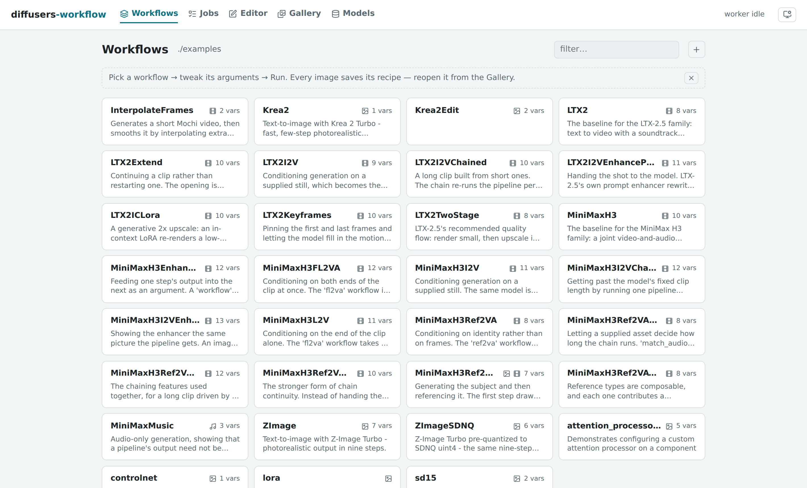

# diffusers-workflow

Your GPU, as something an agent can drive.

diffusers-workflow wraps the [Hugging Face Diffusers library](https://github.com/huggingface/diffusers)
in an engine that runs image, video and audio generation as jobs, and puts
two front ends on it: an **MCP server**, so Claude Code (or any MCP client)
can author, run and inspect generations; and a **web UI** for doing the same
by hand. A CLI and REPL sit underneath for when you want neither.

**Python 3.10-3.14 | CUDA (NVIDIA) | MPS (Apple Silicon) | CPU**

<picture>
  <source media="(prefers-color-scheme: dark)" srcset="docs/img/ui-workflows-dark.png">
  
</picture>

## Getting started

**1. Install.** The script picks the right torch build for your platform,
creates a virtual environment and installs everything, MCP server included.